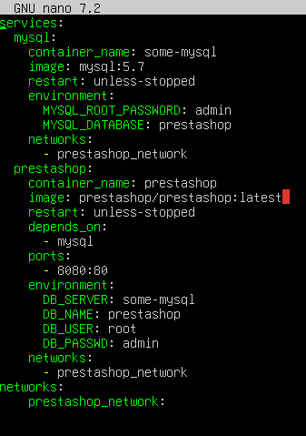
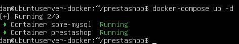

# Ejercicio 6 - Utiliza Docker para poner en marcha PrestaShop

👤 **Autor:** Ana Valladares González

---

### 1. 📦 Crear una carpeta para instalar PrestaShop

Para comenzar, creamos una carpeta llamada `prestashop` en la que se instalará PrestaShop.

**Comando:**
```bash
mkdir prestashop
cd prestashop
```

### 2. 🚀 Crear un archivo Docker-compose.yml para instalar PrestaShop

Dentro de la carpeta `prestashop`, creamos un archivo `Docker-compose.yml` para instalar PrestaShop, posteriormente lo editamos para configurar la instalación.

```yml
touch docker-compose.yml
nano docker-compose.yml
```

**Contenido del archivo:**


### 3. 🔧 Iniciar PrestaShop

Para iniciar PrestaShop, ejecutamos el siguiente comando:

```bash
docker-compose up -d
```



### 4. 🌐 Comprobación de Acceso a PrestaShop

Para comprobar que PrestaShop se ha instalado correctamente, abrimos un navegador y accedemos a `http://localhost:8080`, donde deberemos seleccionar el idioma que deseamos, aceptar los términos y condiciones y rellenar los campos con la información que nos es solicitada.

